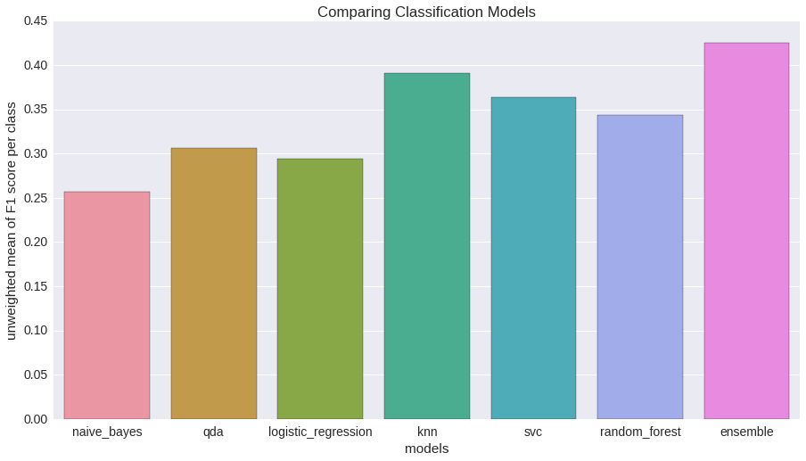
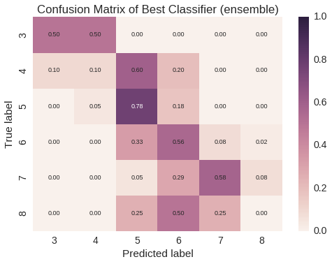
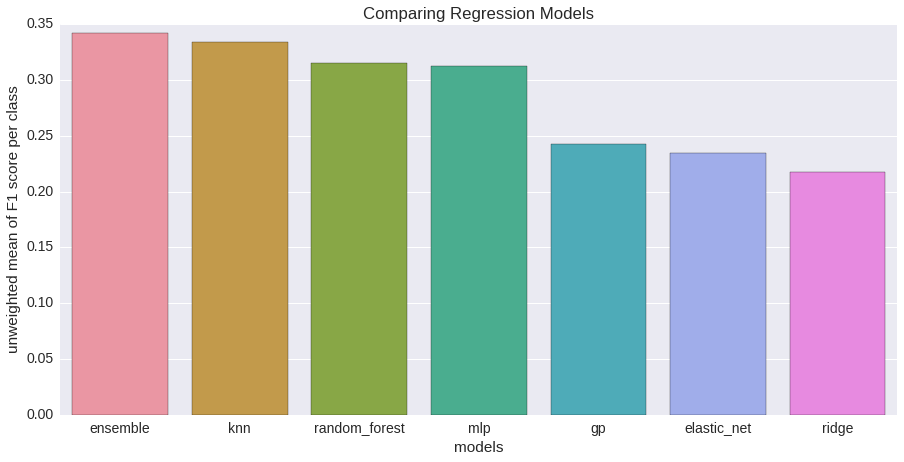
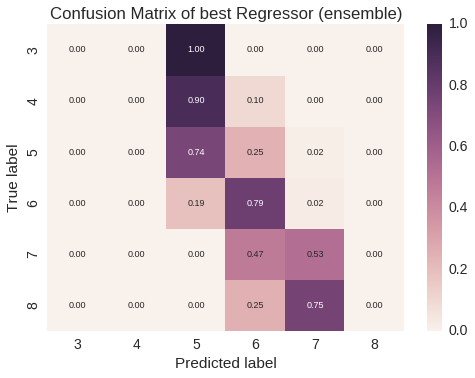
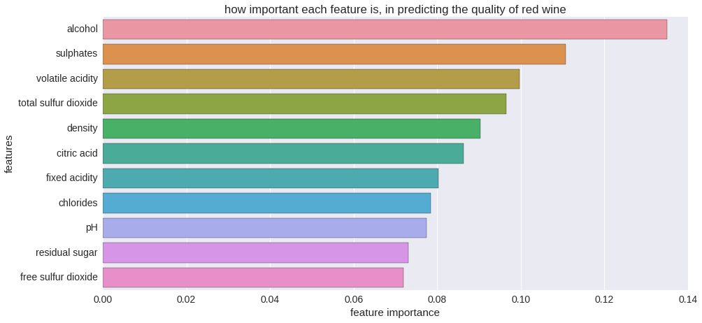

Predicting Quality of Red Wine

by Georgios Pligoropoulos <george@pligor.com>

In this report we are explaining the steps we followed to build our models for predicting the quality of red wine in a simple non-technical way. We are dealing only with red wine. We would follow similar process for white wine or we could even mix them together and include a binary attribute red/white, but our domain knowledge about wines suggests that we shouldn’t.

### Getting a feeling of the dataset

First step is to see what kind of data you have at hand: How many attributes are available per instance, if the attributes are in numerical format, if preprocessing is required and more importantly if there are any missing attributes. The red wine dataset has only numerical data and no missing attributes which means that no special preprocessing is required.

### Exploring our attributes

By exploring the attributes we notice that most of them have positive values and the values of each attribute have a few values in high extreme positive values in comparison to their mean. This is treated by applying the logarithmic function on each attribute. We treat specially the Citric Acid measurement because it has values of absolute zero by first adding one before applying the logarithmic function. These transformations are expected to help our models to learn more easily. Also after applying these transformations we can make the assumption of gaussian distribution for our attributes and thus be able to normalise them by removing bias and scale.

### Outlier Detection

Even after our preprocessing there are some values which are highly unexpected in comparison to the rest of the values of the same attribute in the dataset. We call these outliers. We are using a Tukey test which is commonly used to detect outliers. We observe such extreme values mainly in residual sugar and chlorides and only very few on pH and sulphates. The instances that have such extreme values in their attributes are <5% of the full dataset. We decide to sacrifice and remove completely these instances as they are expected to make learning more difficult and the scoring less accurate.

### Exploring our target, the quality of Red wine

We have quality being one of these values: [3, 4, 5, 6, 7, 8]. The higher the value the better the quality.

Our dataset is highly imbalanced as we have lots of wines being classified with qualities of 5 or 6 while only very few wines are classified are very bad (3) or as extremely good (8) which is expected. In order to compensate for this on training time we are increasing the number of instances by repeating the instances that correspond to the minority.

### Is this a regression task or a classification task?

There are models which will treat each class of the wine separately and their aim is to be able and find decision boundaries that work well for new unseen data. These are the classifiers. On the other hand we have models which are able to predict in-between numbers and thus have as output 5.4 or 7.1 instead of pure classes. These are the regressors. In this project we are exploring both of these models. In addition, we are taking the *assumption* that our final user is interested on pure number of wine quality, so either 5 or 6 or 3. This means that if our regressor produces 3.7 we will round to nearest integer and classify this quality as 4.

### How to evaluate our models

For making automated decisions on model selection we need to quantify the performance of our model and give it a score. For that reason, for the classifiers, we are using F1 score which combines two metrics: Precision which expresses how accurate the model was on predicting a certain class and Recall which expresses the inverse of the regret of missing out instances which are misclassified. Since we have multiple classes we have multiple F1 scores. We will be using the unweighted mean of the F1 scores for our final scoring. This is a *business* decision because we want our models to get optimized to classify instances that belong to the minority side, such as wine quality of 3 or 8 equally well with the rest of the qualities that are represented in a larger number.

For the regression task we are scoring based on the coefficient of determination, which is basically a measurement of whether the predictions and the actual values are highly correlated. The larger this coefficient the better. For regressors we can also get F1 score if we first round our predictions. However for the final selection of our optimized models (either regressors or classifiers) we are going follow a qualitatively approach by plotting a matrix where the rows correspond to the actual quality of the wine and the columns correspond to the predicted quality of the wine. This matrix will help someone who want to make a *business decision* to choose which of the models is best.

### Exploring attributes per Class

Before applying any classifiers we are exploring how each of our attributes are able to separate the classes, given that correlations between attributes are ignored. Our observations reveal that some attributes can separate each of the classes nicely while others do not. We cross-check these observations by calculating the correlation between the quality of the wine and each of the attributes.

### Including Transformations of Original Features

We have relatively few attributes per instance which means that we could help our machine learning models by introducing as extra features some simple mathematical and non-linear transformations. If we have features x and y then we are also introducing, x2, y2, x3, y3 and products of those features: x*y for all possible combinations.

### Dimensionality Reduction

We are exploring different approaches (PCA, Isomap, TSne) for bringing the dimensionality from large dimensions to only two and thus be able to plot them easily. None of the methods results in a scatter plot where classes are clearly separable. This is a good indication that the classification task will not be easy. We are keeping the dimensionality reduction following a method named TSNE in order to use it with one of our classifiers which works best in a lower dimensional space. For this we reduced the dimensions to three.

Note that here we are applying normalisation by removing the bias and the scale prior to applying the dimensionality reduction

### Splitting for Testing

We are keeping 20% of our dataset to treat it as unseen data and be able and test the performance of our models.

We are splitting our dataset in a way such that all of the wine qualities are represented proportionally equally in both training and testing dataset. Other than that the selection is being done randomly with uniform distribution.

### Baseline

To check if our advanced models are better than a dummy model we are using a dummy classifier and a dummy regressor. The dummy classifier is predicting randomly the wine quality based on the proportion of each wine quality in our dataset. We are repeating this process ten thousand times to get a range of the possible scores you could get. By keeping the worst performance of the top 5% we are expecting our classifiers to perform better than this value. The dummy regressor always predict the same value for all instances. To get a range here we are shuffling and sampling our dataset ten thousand times repeating the scoring. For regression the score is given by the coefficient of determination. By taking the worst coefficient of determination of the top 5% we are expecting our models to be at least better than this score.

### Models

<table>
  <tr>
    <td>For classification</td>
    <td>For regression</td>
  </tr>
  <tr>
    <td>K-Nearest Neighbours classifier</td>
    <td>Ridge Linear regressor</td>
  </tr>
  <tr>
    <td>Support Vector Machine classifier</td>
    <td>Elastic Net Linear regressor</td>
  </tr>
  <tr>
    <td>Random Forest Decision Trees classifier</td>
    <td>Random Forest Decision Tree regressor</td>
  </tr>
  <tr>
    <td>Logistic Regression classifier</td>
    <td>K-Nearest Neighbours regressor</td>
  </tr>
  <tr>
    <td>Quadratic Discriminant Analysis classifier</td>
    <td>Gaussian Process regressor</td>
  </tr>
  <tr>
    <td>Naive Bayes classifier</td>
    <td>Multi-Layer Perceptron Neural Network regressor</td>
  </tr>
</table>

### Optimization

The hyper-parameters of our models that are task-specific, and should be customized also for this task of predicting wine quality, are being optimized with gaussian processes and bayesian optimization. This excludes any models that lack of hyperparameters such as the Naive Bayes Model. To be more precise the bayesian optimization starts with randomly selected hyperparameters and then it proceeds to using Gaussian Processes. The main effect is that even if we have an infinite combination of possible hyperparameters we could try, gaussian processes are able within a few iteration to find the optimal combination of these hyperparameters.

### Appendix - Results

